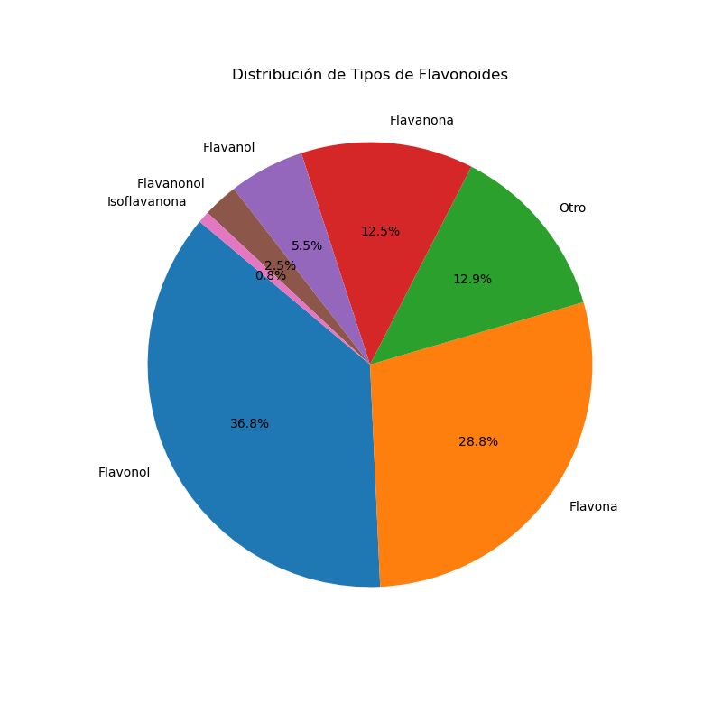

# Análisis a Base de Datos de Flavonoides

Este repositorio contiene un notebook de análisis de datos de flavonoides, el cual puede ser ejecutado fácilmente desde Google Colab. 
La base de datos utilizada fue extraída del repositorio: [Freston1605/ucp_project](https://github.com/Freston1605/ucp_project).

## Ejecución desde Google Colab

Puedes visualizar y ejecutar el notebook directamente desde Google Colab haciendo clic en el siguiente enlace:

## Contenido del Repositorio

- **flavonoids_collab.ipynb**: Este archivo contiene el notebook de Jupyter con el análisis de la base de datos de flavonoides.
- **flavonoids_data.csv/**:  Base de datos extraída del repositorio mencionado anteriormente.
- **imgs/**: Carpeta que contiene las imagenes que se muestran en el notebook

## Ejecución Local (opcional)

Si deseas ejecutar el notebook de forma local en tu máquina, puedes hacerlo siguiendo estos pasos:

1. Clona este repositorio o descárgalo como ZIP.
2. Abre el archivo `flavonoids_collab.ipynb` en Jupyter Notebook o JupyterLab.
3. Ejecuta las celdas en orden para reproducir el análisis.

## Contribuciones

¡Se aceptan contribuciones! Si deseas mejorar este análisis, corregir errores o agregar nuevas funcionalidades, no dudes en enviar un pull request.
